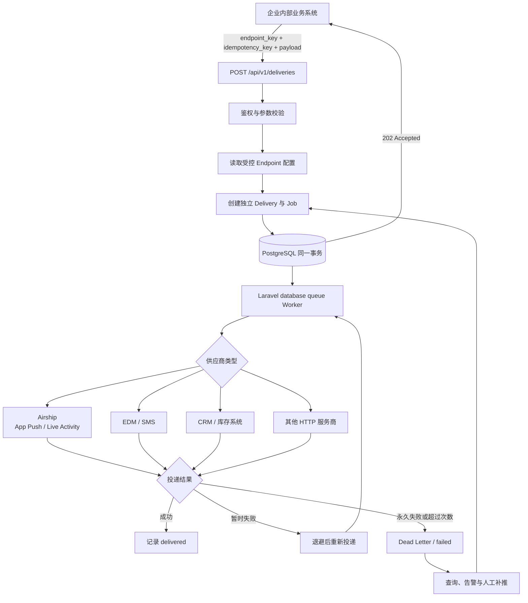

# 企业内部消息通知系统

## 1. 我对问题的理解

这是一个面向企业内部多个业务系统的统一消息通知系统。

用户注册、付款成功、购买商品等行为发生后，业务系统只需要调用统一的通知 API。完整形态下，业务系统可以提交事件行为标识，由通知系统完成路由和模板渲染；当前 MVP 为了控制边界，接收的是已经确定目标的通知请求，并提供：

- 供应商目标标识 `endpoint_key`；
- 本次事件的唯一幂等标识；
- 已按供应商协议组装的 Payload、Content-Type 和少量允许动态传入的 Header。

在后续完整形态中，通知系统可以根据事件行为标识找到对应的通知规则、内容模板和供应商 Endpoint，再将内容转换为供应商需要的 Header 与 Body。例如：

- `user.registered` 可以发送 Airship App Push、Live Activity 或 EDM；
- `subscription.paid` 可以通知 CRM 修改用户状态；
- `order.purchased` 可以通知库存系统扣减库存；
- 其他事件可以发送 SMS，或调用其他系统服务商的 HTTP API。

因此，企业内部各业务系统不需要分别管理 Airship、EDM、SMS、CRM 或库存系统的地址、认证凭据、超时和重试逻辑。事件路由和模板集中管理是后续能力，当前代码尚未实现，不能把它描述为已经交付的功能。

系统最重要的责任不是简单地转发 HTTP 请求，而是：

1. 提供稳定、统一的事件接入入口；
2. 隔离内部业务系统与外部供应商的协议差异；
3. 持久保存已经接受的通知，避免因服务重启或供应商短暂故障而丢失；
4. 对失败进行有限重试，并为最终失败提供可查询、可人工补推的处理出口；
5. 管理重复投递风险，避免库存重复扣减、状态重复修改和通知骚扰。

当前代码实现的是上述架构中的“可靠投递核心”：使用 `endpoint_key` 表示已经解析出的供应商目标，由调用方提交供应商格式的 Payload。基于事件行为标识的路由和模板渲染属于后续整体架构职责，但不在本次 MVP 代码中展开，避免第一版同时建设规则引擎与模板平台。

### 1.1 系统边界

本次选择解决：

- 对企业内部调用方进行鉴权，并限制其能够使用的供应商 Endpoint；
- 集中管理供应商 URL、HTTP Method、静态凭据、超时和重试参数；
- 接收并持久保存 HTTP 通知请求，再由后台 Worker 投递；
- 提供接入幂等、投递状态、尝试记录、有限重试、最终失败和人工补推；
- 避免敏感凭据和完整业务 Body 被序列化到队列任务中。

本次明确不解决：

- **不监听业务系统的领域事件**：上游负责在业务动作完成后调用本服务，否则还需要处理上游数据库与事件发布的一致性问题。
- **不实现事件路由、营销规则和模板平台**：这些能力不是验证可靠 HTTP 投递闭环的必要条件，第一版引入会显著扩大范围。
- **不保证外部副作用 exactly-once**：外部供应商不参与本地数据库事务，只能采用至少一次投递，并要求目标接口配合幂等。
- **不保证供应商永久不可用时仍能送达**：有限重试耗尽后进入失败状态，供查询和监控告警，由人工判断补推、修正配置或放弃。
- **不实现严格顺序和多供应商原子成功**：每个 Endpoint 是独立 Delivery，避免一个供应商故障阻塞其他目标。
- **不判断供应商的业务处理结果**：MVP 只依据 HTTP 状态判断是否到达，不解析供应商响应 Body。

### 1.2 整体架构与核心思想



未来需要集中路由和模板时，可以在统一 API 与 Delivery 之间增加事件路由层，但不会改变可靠投递核心。

核心设计思想如下：

- **统一接入，供应商解耦**：MVP 集中管理供应商连接和可靠性策略；未来增加事件路由后，内部系统可以只表达发生了什么。
- **单目标独立 Delivery**：同一事件需要通知多个供应商时，拆成多个独立 Delivery；Airship 失败不会阻塞 CRM 或库存系统。
- **先持久化，再投递**：只有通知记录成功保存后才向业务系统确认接收。
- **状态机驱动**：使用 `pending → processing → delivered / failed` 表达投递生命周期。
- **至少一次投递**：宁可在不确定故障后重试，也不能静默丢弃已经接受的通知。
- **端到端幂等**：接入侧避免重复创建 Delivery，投递侧携带稳定的幂等键，供应商或目标业务接口按该键避免重复副作用。
- **失败必须有出口**：重试不能无限进行，最终失败进入死信状态，由告警和人工补推形成闭环。

### 1.3 关键工程决策与取舍

#### 如何避免重复推送和重复业务副作用

只依靠通知系统，无法严格保证外部业务“恰好执行一次”。例如供应商已经完成库存扣减，但成功响应在网络中丢失，通知系统无法判断对方究竟有没有执行，只能选择重试或放弃。

本系统选择 **至少一次投递 + 端到端幂等**：

- 内部业务系统为每个业务动作提供稳定的 `idempotency_key`；
- 同一个调用方重复提交相同内容时返回原 Delivery，不重复创建任务；
- 相同幂等键对应不同内容时拒绝请求，避免错误覆盖；
- 每次调用供应商都传递同一个幂等键；
- CRM、库存等有副作用的接口必须按该键去重，或使用业务版本号、库存流水号等自然幂等机制；
- 已经进入 `delivered` 的任务即使被 Worker 再次领取，也不会再次调用供应商。

对于 App Push、EDM、SMS 等通知骚扰场景，除幂等键外，还可以在未来增加用户、模板和时间窗口维度的频率限制。第一版不把频控规则写死在可靠投递层。

#### 失败重试与死信补推

- HTTP `2xx` 视为投递成功；
- `408`、`429`、`5xx`、连接失败和超时通常可以重试；
- 认证失败、格式错误等普通 `4xx` 不会因为等待而恢复，直接进入最终失败；
- 重试采用逐步增长的退避时间并加入随机抖动，避免供应商恢复时发生重试洪峰；
- 达到最大次数后标记为 `failed`，保留最后错误和每次尝试记录；
- 运维人员确认供应商已经恢复、请求仍然有效后，可以人工补推；
- 人工补推开启新的 delivery round，旧轮次任务不能覆盖新轮次状态。

#### 第一版不引入独立消息队列

第一版不引入 Redis、RabbitMQ、Kafka 或 SQS 等独立消息队列，原因是当前首先要验证统一接入、持久化、重试和人工补推闭环，而不是提前解决尚未出现的吞吐瓶颈。

当前实现使用 Laravel database queue：Delivery 与 `jobs` 写入同一个数据库事务，本质上是数据库持久化任务加后台 Worker，不增加第二个有状态基础设施。这样可以避免数据库保存成功、但向外部 MQ 发布失败的双写问题。

它仍然是一种队列调度方式，但不是独立消息中间件。未来数据库轮询成为瓶颈后，再迁移 Redis 或 SQS，并通过 Transactional Outbox 解决数据库与消息队列之间的一致性问题。

#### 未来如何演进

演进以监控数据和实际瓶颈为依据，而不是预先堆叠组件：

1. 先增加 Endpoint 维度的并发限制、速率限制和熔断，避免单个故障供应商拖垮全部 Worker；
2. API 与 Worker 无状态化并分别水平扩展，按 Endpoint 或业务优先级拆分队列；
3. database queue 成为吞吐瓶颈后迁移 Redis 或 SQS，同时引入 Transactional Outbox 保证业务记录与队列发布一致；
4. 确有多个业务方重复维护路由和模板时，再建设事件路由、版本化模板及供应商 Adapter；
5. 补充积压数量、最老任务等待时间、失败率、`429` 比率和死信数量等可观测指标与告警。

## 2. 代码实现

```text
.
├── app
│   ├── Console/Commands
│   │   ├── CreateApiClient.php       # 创建内部调用方及 API Key
│   │   ├── GrantEndpoint.php         # 授权调用方使用供应商 Endpoint
│   │   ├── UpsertEndpoint.php        # 维护供应商地址、凭据与重试策略
│   │   └── PruneDeliveries.php       # 清理过期投递记录
│   ├── Enums/DeliveryStatus.php      # Delivery 状态定义
│   ├── Http
│   │   ├── Controllers/DeliveryController.php
│   │   ├── Middleware/AuthenticateApiClient.php
│   │   ├── Requests/StoreDeliveryRequest.php
│   │   └── Resources/DeliveryResource.php
│   ├── Jobs/DeliverNotification.php  # HTTP 投递、错误分类、退避和死信
│   ├── Models
│   │   ├── ApiClient.php
│   │   ├── Endpoint.php
│   │   ├── Delivery.php
│   │   └── DeliveryAttempt.php
│   └── Services/DeliveryService.php  # 幂等、授权与原子创建任务
├── config/notifications.php          # 通知系统配置
├── database/migrations               # 业务表与 Laravel 队列表
├── routes/api.php                    # 创建、查询与人工补推 API
├── routes/console.php                # 定时清理任务
└── tests/Feature                     # API、可靠投递、持久化与清理测试
```

## 3. AI 使用说明

### 3.1 AI 在哪些关键地方提供了帮助

- **需求分析与问题拆解**：我先向 AI 描述业务背景和大致需求，AI 协助区分事件、供应商 Endpoint、Delivery 和投递尝试等概念，并将需求拆解为统一接入、持久化、异步投递、失败重试、死信和人工补推等最小可行模块。
- **架构与流程图表达**：我提供大致业务流程，AI 协助整理系统边界，并生成了相对专业、直观易懂的 Mermaid 流程图。
- **可靠性场景分析**：AI 帮助分析了供应商已经执行但响应丢失、任务成功后本地状态尚未保存等异常窗口，使方案明确采用“至少一次投递 + 端到端幂等”，而不是无法兑现的 exactly-once。
- **安全与工程细节检查**：AI 提醒了 URL 透传可能产生的 SSRF、HTTP 重定向、敏感凭据进入队列 Payload，以及无限重试造成任务堆积等风险。
- **代码实现辅助**：在技术方向确定后，AI 协助生成 Laravel 的迁移、Model、API、Job、命令和测试草案，再由我结合需求检查并调整。

### 3.2 AI 给出过但没有采纳的建议

- **Python + FastAPI 方案**：AI 最初建议使用 Python、FastAPI 和 SQLite。虽然适合快速实现，但我对该技术栈不够熟悉，无法有把握地检查框架惯例、依赖和实现细节。直接采用容易被 AI 的答案牵着走，失去对错误方案进行纠正的能力，因此最终改为更熟悉的 Laravel、PHP 和 PostgreSQL。
- **同时引入 Kafka、Redis 和 PostgreSQL**：当前没有明确的高吞吐数据作为依据，引入多个有状态中间件会明显增加部署、监控和故障恢复成本。第一版采用 Laravel database queue，先验证可靠投递闭环。
- **额外增加 Transactional Outbox**：Delivery 和 database queue 的 `jobs` 表可以在同一个 PostgreSQL 事务中写入，再增加 Outbox 会形成重复保障。迁移到 Redis、SQS 等独立队列时再引入更合适。
- **第一版实现通用多渠道框架和模板 DSL**：Airship、EDM、SMS、CRM 和库存系统的协议与副作用差异较大，过早统一抽象容易得到复杂但不准确的公共模型。当前 MVP 聚焦可靠 HTTP 投递，事件路由、模板和复杂渠道适配留待真实需求明确后演进。
- **无限重试或宣称 exactly-once**：永久性 `4xx`、错误数据和已经下线的供应商无法通过持续重试恢复；外部系统又不参与本地事务，因此这两种承诺都不现实。本方案选择有限重试、死信、人工确认补推和端到端幂等。

### 3.3 我自己做出的关键决策及原因

- **选择熟悉且可判断的技术栈**：最终使用 Laravel、PHP 和 PostgreSQL。技术选型不仅看生成速度，也要确保维护者能够理解代码、发现问题并对 AI 输出作出正确判断。
- **第一版先建设可靠投递核心**：当前代码不承担企业内部事件监听、营销规则和完整模板平台，只接收已经确定目标的 `endpoint_key` 与 Payload，控制 MVP 的边界和复杂度。
- **不引入独立消息中间件**：先使用同库 database queue，把 Delivery 与 Job 原子写入，优先解决“不丢消息、能够重试、失败可处理”，等出现真实并发瓶颈后再演进。
- **采用至少一次投递和端到端幂等**：网络调用存在无法消除的不确定状态，因此不作 exactly-once 承诺。库存扣减、CRM 状态修改等有副作用的接口必须使用稳定幂等键或业务流水号去重。
- **一个请求只对应一个供应商 Endpoint**：多供应商通知拆成独立 Delivery，使每个目标可以独立成功、重试或补推，避免一个供应商失败影响其他目标。
- **业务状态不依赖 Laravel 的 `jobs/failed_jobs`**：这两张表只承担队列基础设施职责；Delivery 和 Attempt 单独记录可查询的业务状态与审计信息，避免队列记录被清理后失去业务事实。
- **失败采用有限重试并保留人工出口**：可恢复错误自动退避重试，永久错误或超过次数的任务进入死信；人工确认请求仍然有效后再补推，避免无界堆积、重复扣库存或持续骚扰用户。

AI 在本项目中承担的是分析、表达、代码草拟和风险检查工作。系统边界、技术选型、可靠性承诺及复杂度取舍由我结合自身经验和维护能力作出，并对 AI 输出进行人工校准，而不是直接照搬生成结果。
